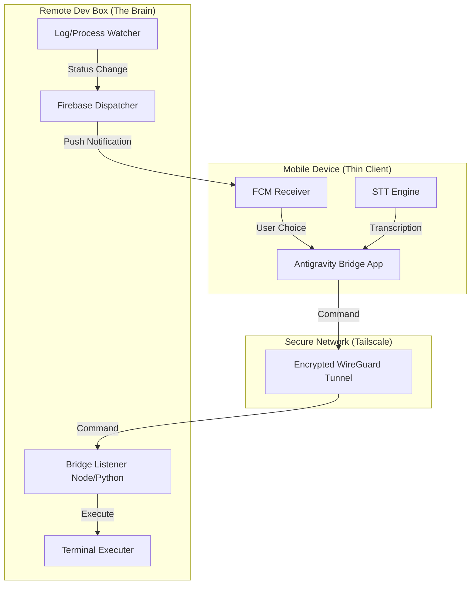

# Antigravity Bridge: Technical Architecture

The Antigravity Bridge is a high-productivity link between your remote development "Brain" and your mobile "Thin Client." It enables voice-controlled development and instant notification loops ("Dings") for seamless coding from anywhere.

## 1. System Overview

## 2. Component Details

### A. The Remote Listener (Backend)
- **Runtime**: Python or Node.js.
- **Responsibility**: Listens for JSON command payloads, executes them in the local shell, and returns stdout/stderr.
- **Security**: Bound to the Tailscale IP only. Requires an API Key/Token for every request.

### B. The Process Watcher
- **Responsibility**: Hooks into compilation or test runners.
- **Trigger**: When a specific regex is matched (e.g. `FAILED`, `successfully built`), it triggers a notification.
- **The "Ding"**: A specialized FCM payload that forces a sound and an actionable notification on the mobile client.

### C. The Mobile App (Frontend)
- **Framework**: Flutter.
- **UI Focus**: 
    - Large, accessible Voice button.
    - Mini-terminal view for reading output.
    - Quick-action dashboards (Run Build, Git Status, Deployment).
- **Voice Logic**: Converts "Build the project" into `npm run build` or equivalent.

### D. Push Infrastructure
- **Service**: Firebase Cloud Messaging (FCM).
- **Payloads**: 
    - `type: status` (Green/Red icon).
    - `type: prompt` (Yes/No buttons on the notification itself).
